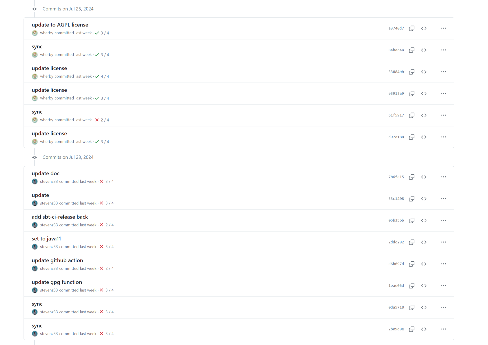
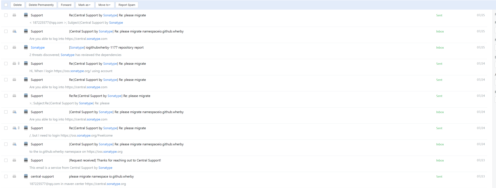
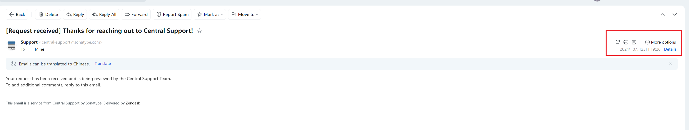
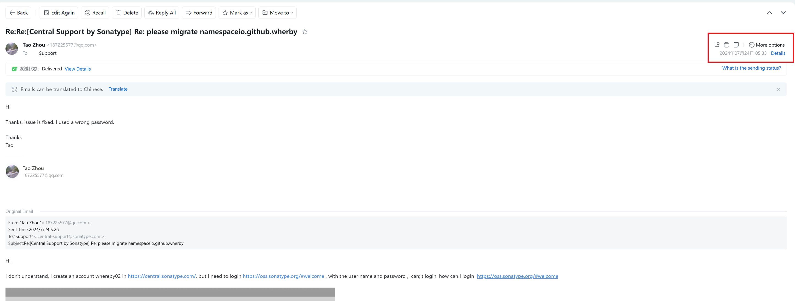

# Commitment to Security and User Support

The author is committed to providing the highest level of security for commercial users. To ensure timely security updates, which often require significant development resources, commercial users are encouraged to register their usage. This information aids in effective resource allocation and prioritization of security enhancements.

For example the last security upgrad:

Addressing security vulnerabilities requires substantial effort. Registering commercial use helps us prioritize updates and allocate resources effectively, ensuring timely protection for all users.