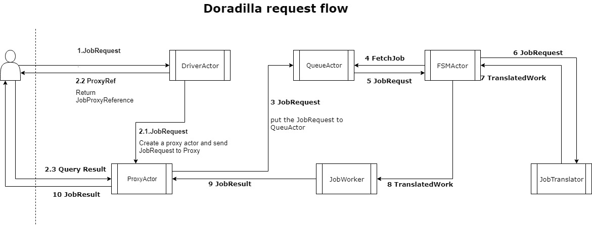
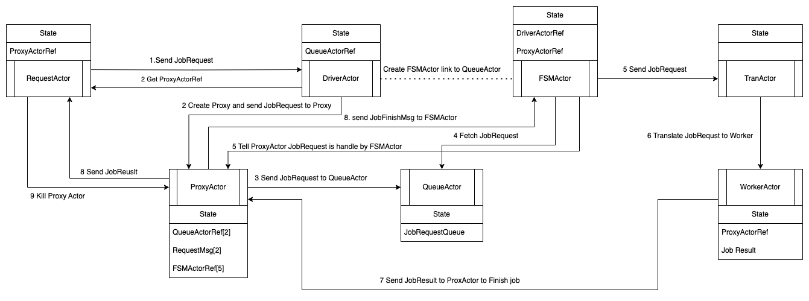

# Message flow




# JobRequest flow

## JobRequest
```Scala
  case class JobRequest(
      taskMsg: JobMsg,
      replyTo: ActorRef,
      tranActor: ActorRef,
      priority: Option[Int] = None,
      jobMetaOpt: Option[JobMeta] = None
  )
```




## ReceiveActor

The AskProcessResult using ReceiveActor create a API to trigger jobrequest call of
( jobRequest: JobRequest,
driver: ActorRef,
receiveActor: ActorRef,
timeout: Timeout) =>Future[JobResult], and ReceiveActor is "RequestActor" in the JobRequest work flow chat.

AskProcessResult
: @@snip [AskProcessResult](./code/AskProcessResult.scala)

ReceiveActor
: @@snip [ReceiveActor](./code/ReceiveActor.scala)


