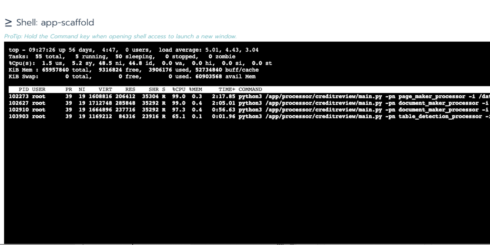
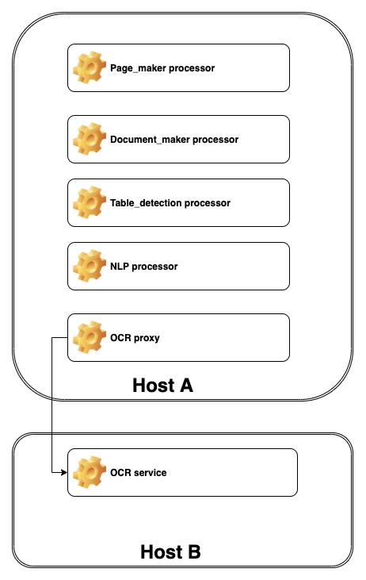

# Use case

## JobApi for processor control 

For document extraction project, the document will go through these processors as below:

And each processor will occupy one CPU core. If the host machine has only 4 CPU cores, 
if you start 5 document procession at a time, the processors need at least 5 CPU cores.

Use JobApi to set the workers number for driver will control the concurrent jobs as
below:

## Named job usage

For the same document processing project, the "OCR processor" is provided by 3rd-party vendor.
So the "OCR processor" will not running on the same host with other processor.

If all processors use same JobAPi, when one worker is taking "OCR processor" job, then one CPU on the host will 
be not well utilized.

So the "OCR processor" could be assigned to another driver use the named job feature:

@@ snip [named job call] (code/namedprocessor.scala)

and the processor as below:

